# Geofence Route Generator

A TypeScript agent that discovers storefront businesses within a geofence, optimizes a driving route, and delivers output via Slack or email. Built for Google Agentspace using Vertex AI Agent Builder and Extensions.

## 🎯 Overview

This tool streamlines field sales prospecting by automatically generating optimized routes to nearby businesses within a defined geographic area. Perfect for sales reps who need to maximize their time in the field.

## 🔄 Workflow

```mermaid
---
config:
  layout: fixed
---
flowchart LR
    A["Define Geofence<br>(Address + Mile Radius)"] --> B["Scrape Nearby Businesses<br>(Clay / ChatGPT / Maps API)"]
    B --> C["Filter by Target Criteria<br>(Industry, Size, Open Now)"]
    C --> D["Generate Location-Based Target List<br>(Name, Location, URL, Notes)"]
    D --> E["Push to CRM, Sheets, or SMS to me directly"]
    E --> F["Visit or Contact In-Person"]
    F --> G["Log Results + Notes"]
     A:::step
     B:::step
     C:::step
     D:::step
     E:::step
     F:::step
     G:::step
    classDef step fill:#f9f9f9,stroke:#333,stroke-width:1px
    style B stroke:#D50000
    style E stroke:#D50000
    style F color:#000000,stroke:#2962FF
    style G stroke:#2962FF
```



## 🚀 Features

- **Geofence Discovery**: Find businesses within a specified radius (2-10 miles)
- **Smart Filtering**: Exclude unwanted categories (restaurants, salons, etc.)
- **Route Optimization**: Google Maps waypoint optimization for efficient driving
- **Multiple Outputs**: Google Sheets (mobile-friendly) or CSV download
- **Flexible Delivery**: Slack DM, email, or in-app preview
- **Human-in-the-Loop**: Preview before sending for quality control

## 📁 Project Structure

```
├── agents/geofence-route/     # Agent configuration and routing
├── services/                  # Core business logic functions
├── models/                    # TypeScript interfaces
├── utils/                     # Helper utilities
├── extensions/                # Vertex AI Extension configs
├── test/                      # Test fixtures and scenarios
├── docs/                      # Documentation and architecture
└── deployment/                # Deployment guides
```

## 🛠️ Quick Start

1. **Install dependencies**:
   ```bash
   npm install
   ```

2. **Build the project**:
   ```bash
   npm run build
   ```

3. **Run locally**:
   ```bash
   npm start
   ```

## 🔧 Configuration

### Input Parameters

- `location`: Address or lat/lng coordinates
- `radius_miles`: Search radius (2-10 miles, default: 5)
- `excluded_categories`: Categories to filter out (e.g., "restaurant", "salon")
- `output`: "sheet" | "csv" | "both" (default: "sheet")
- `deliver`: "slack" | "email" | "auto" (default: "auto")

### Example Usage

```typescript
const inputs: GeofenceInputs = {
  location: "1600 Amphitheatre Pkwy, Mountain View, CA",
  radius_miles: 5,
  excluded_categories: ["restaurant", "salon"],
  output: "both",
  deliver: "slack",
  slack_recipient: "@salesrep"
};
```

## 🏗️ Architecture

The system uses Google Agentspace with Vertex AI Extensions for secure API access:

- **Google Places API**: Business discovery
- **Google Directions API**: Route optimization
- **Google Sheets API**: Output generation
- **Google Drive API**: File sharing
- **Slack API**: Message delivery
- **Gmail API**: Email delivery

## 📚 Documentation

- [Functional Specification](docs/functional-spec.md)
- [Architecture Diagram](docs/architecture.mmd)
- [API Scaffolds](docs/api-scaffolds.md)
- [Deployment Guide](deployment/agentspace.md)
- [IAM Configuration](deployment/iam.md)

## 🧪 Testing

The project includes test fixtures and a test mode for development:

```bash
# Enable test mode
TEST_MODE=true npm start
```

## 🚀 Deployment

1. Configure Vertex AI Extensions with proper API scopes
2. Import agent configuration from `agents/geofence-route/agent.json`
3. Deploy to Agentspace Agent Gallery
4. Test with human-in-the-loop workflows

## 📄 License

This project is part of a geospatial prospecting toolkit for field sales teams.

## 🤝 Contributing

This is a scaffolding project. For production deployment, ensure all API credentials are properly configured through Vertex AI Extensions and follow security best practices outlined in the deployment guides.

